This page summarizes the results of running our structure-function-to-She-Leveque inference process for the (10k)^3 simulation data that James had on hand.
We use the transverse and longitudinal structure functions he had previously calculated for O(20) snapshots.

We estimate measurement uncertainties with the sample variance of each increment across snapshots.
To help with numerical efficiency within the sampling proceedure, we additionally

  * set a lower limit on the relative uncertainty in each measured structure function of > 5%. This primarily affects low-order structure functions
  * resample the measured structure function to a logarithmic grid (instead of linear) and only retain 51 sample points. We linearly interpolate both the mean and standard deviation of the measured structure function.

Below, I show the inferred structure functions as a function of scale along with the She-Leveque parameters and violin plots.
These are separated by field (either `vel` or `mag`) and direction (`long` or `trsv`).

The She-Leveque ansatz is taken to be a prediction for the averaged scaling exponent over some range of scales.
I consider several different ranges (with boundaries chosen by eye to correspond to approximately constant logarithmic derivatives).
Results for each range are shown separately as well.

---

# vel

---

## vel trsv

### vel trsv 3e-4 6e-4

|structure function|scaling exponent|
|---|---|
|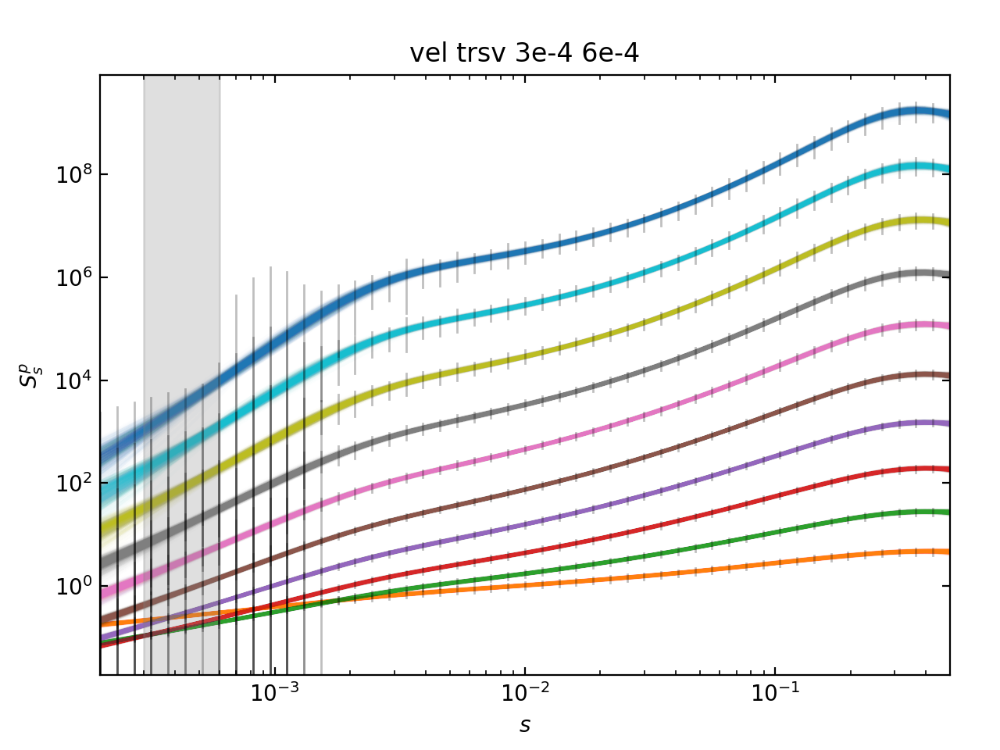|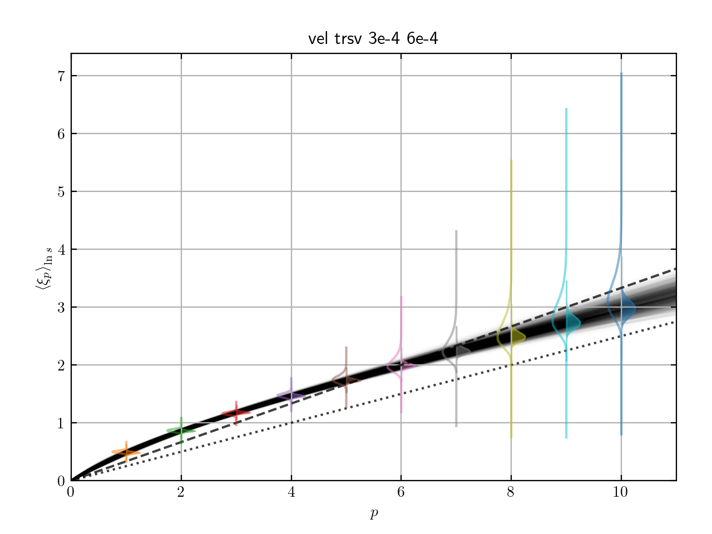|
|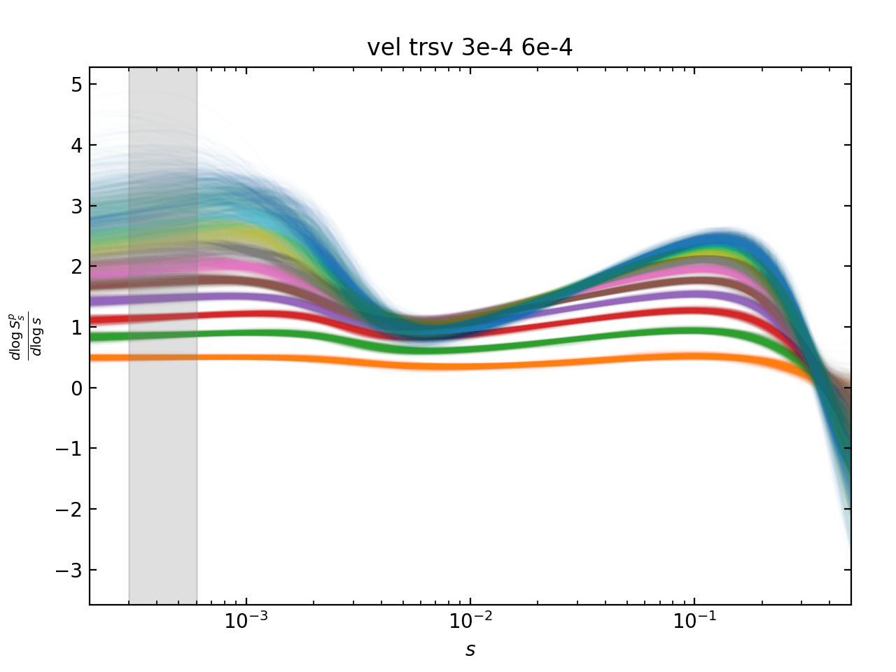|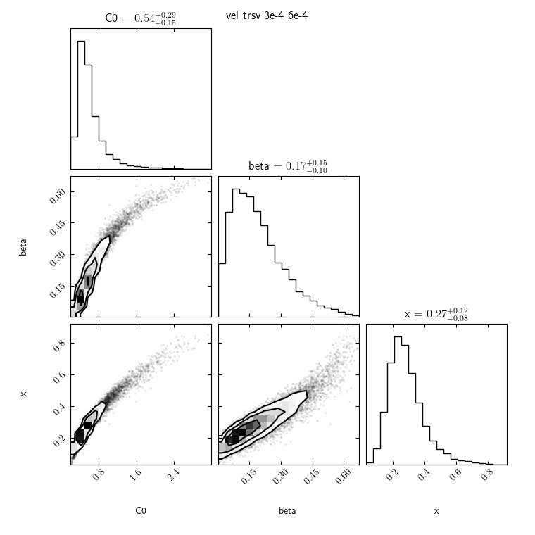|

### vel trsv 3e-4 6e-4

|structure function|scaling exponent|
|---|---|
|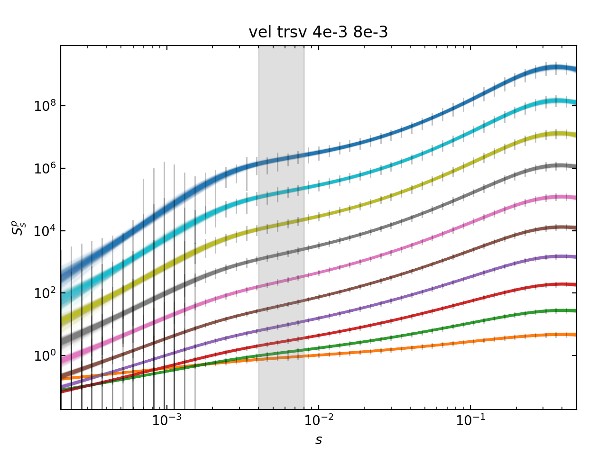|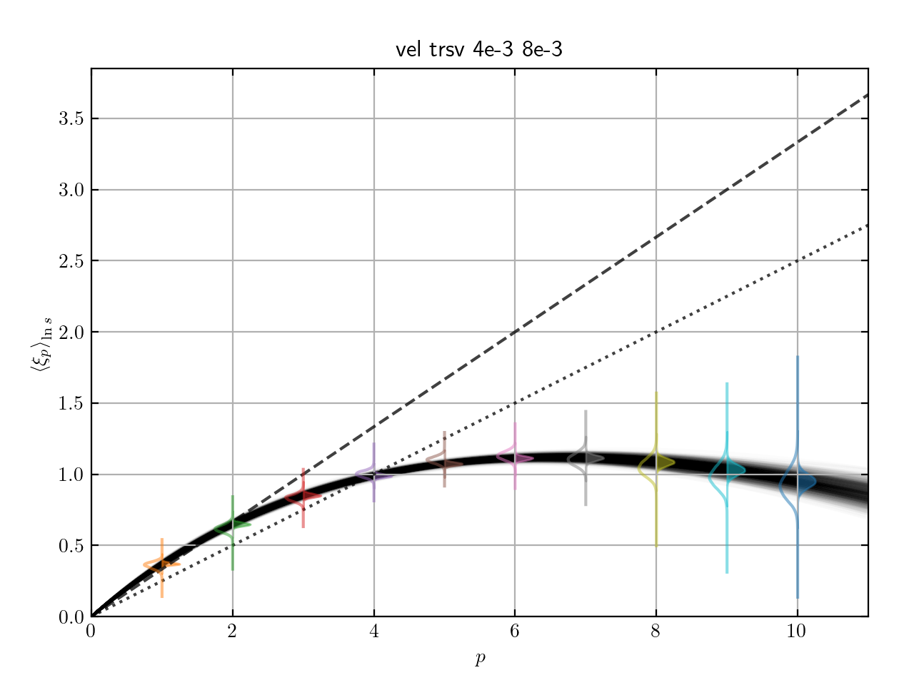|
|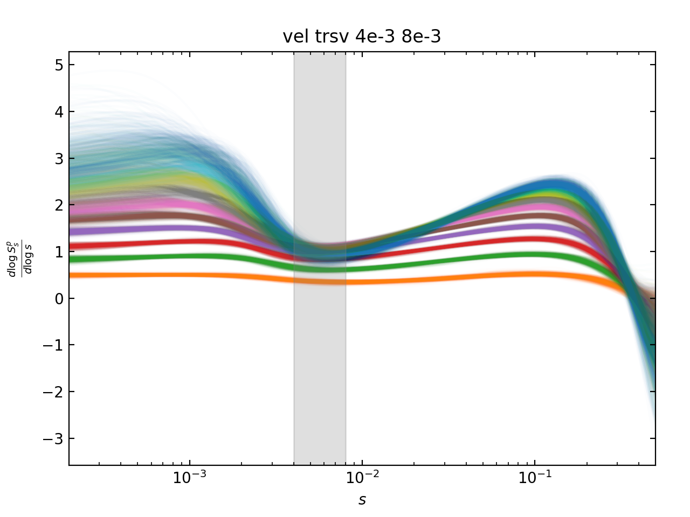|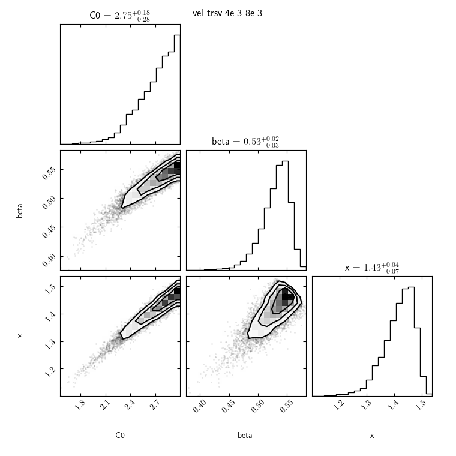|

### vel trsv 3e-4 6e-4

|structure function|scaling exponent|
|---|---|
|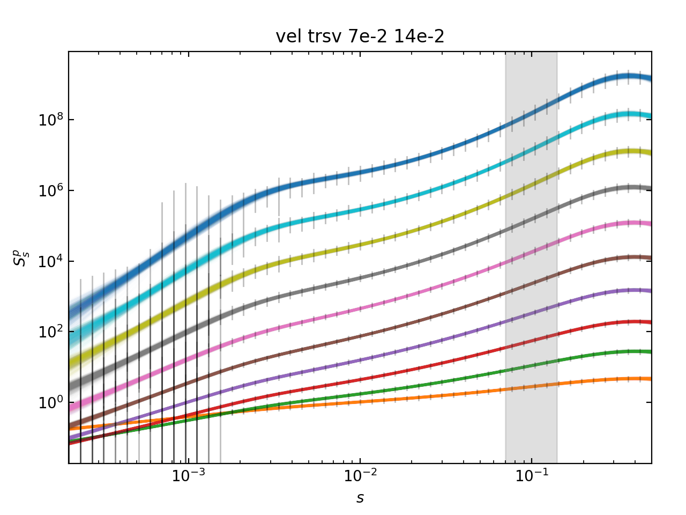|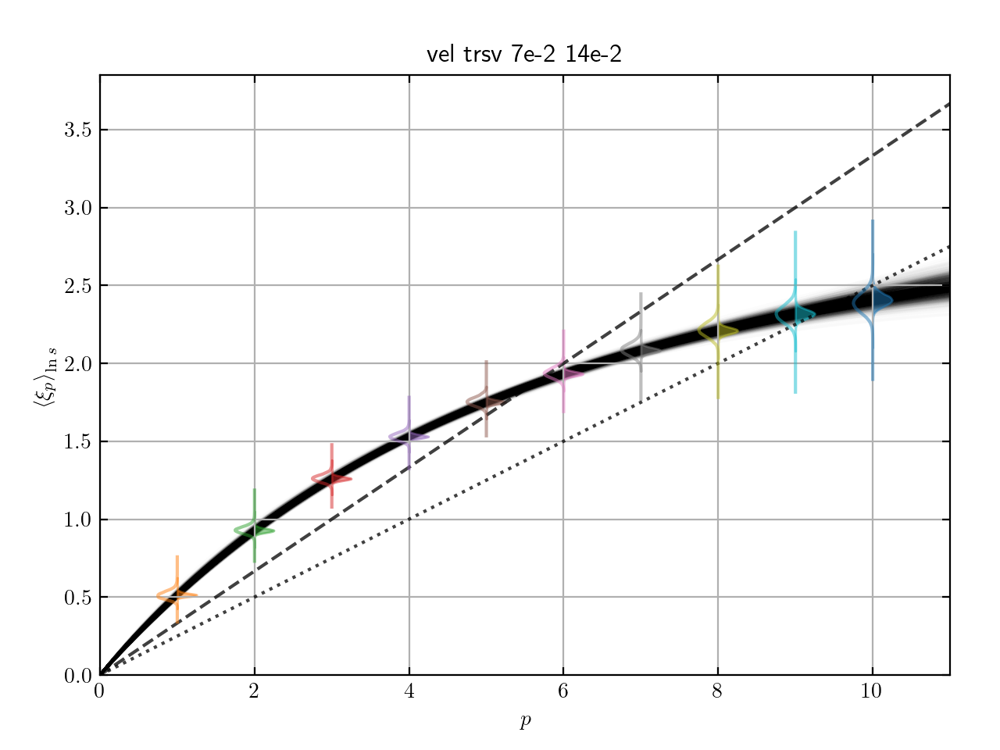|
|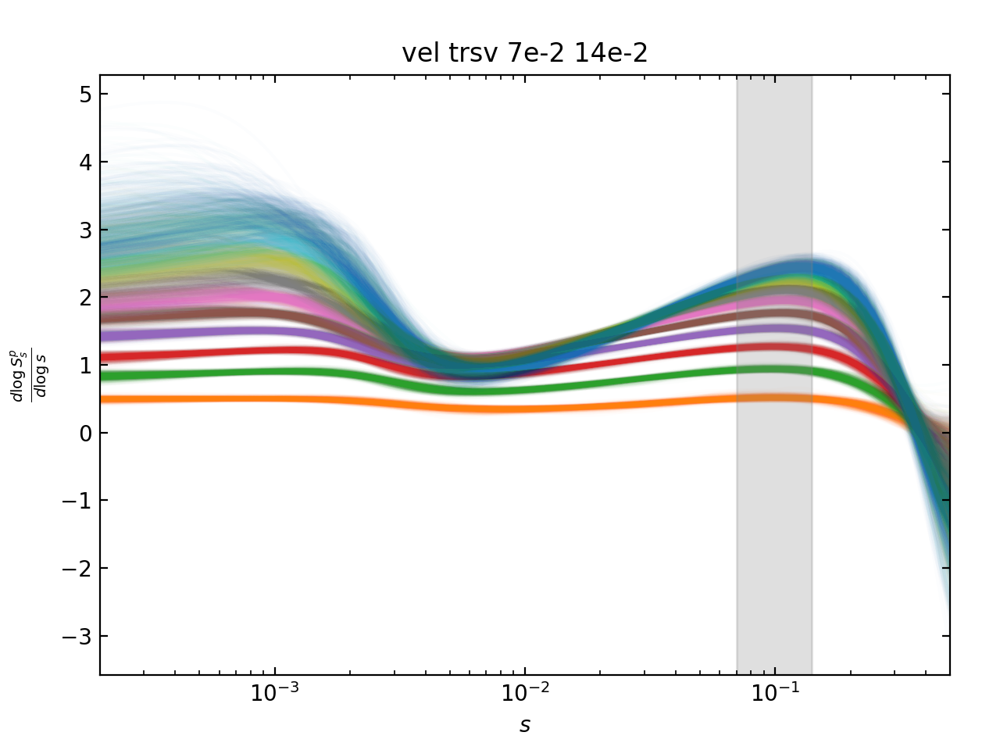|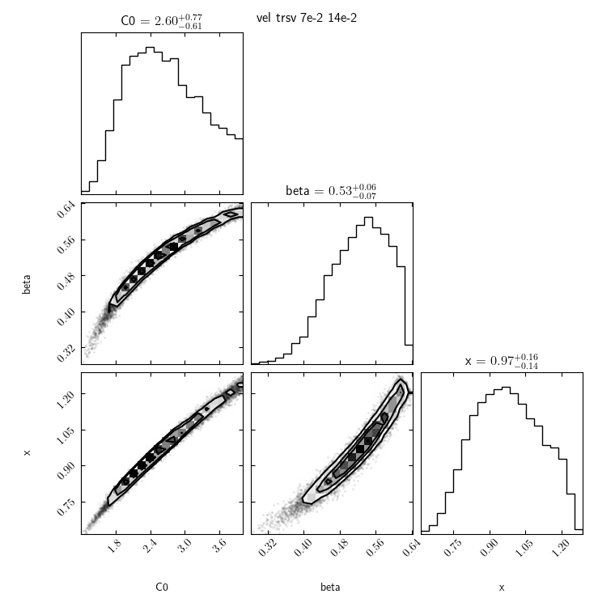|

---

## vel long

### vel long 3e-4 6e-4

### vel long 7e-3 14e-3

### vel long 6e-2 12e-2

---

# mag

---

## mag trsv

### mag trsv 7e-4 14e-4

---

## mag long

### mag long 7e-4 14e-4
