# Structure Functions

Below, we summarize the structure functions for many snapshots for each set of flow parameters and field.
Structure functions are color-coded by their order as follows

  * 1st order : blue
  * 2nd order : orange
  * 3rd order : green
  * 4th order : red
  * 5th order : purple
  * 6th order : brown

Each field has a table showing the structure functions calculated separately for each of the 51 snapshots available with the same flow parameters.

---

## Density

### Direct Structure Function

|M/MA| 01 | 05 | 1 | 2 | 4 | 6 | 8 | 10 |
|----|----|----|---|---|---|---|---|----|
| 05 |||||||||
| 2  |||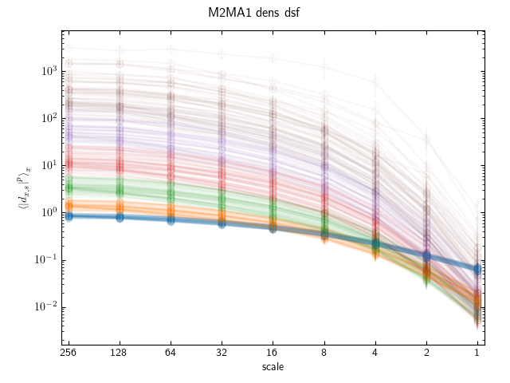||||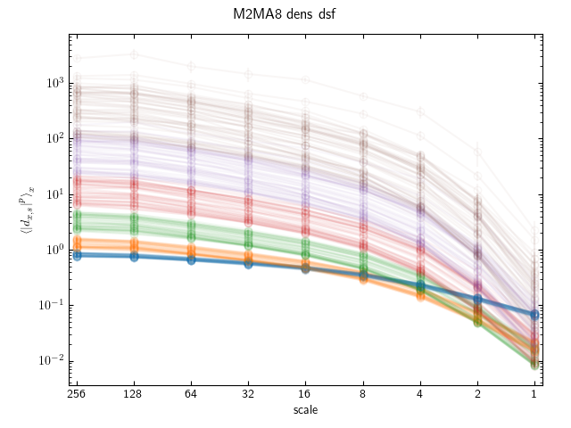|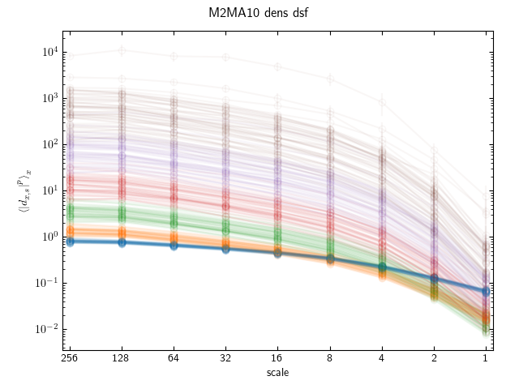|
| 4  |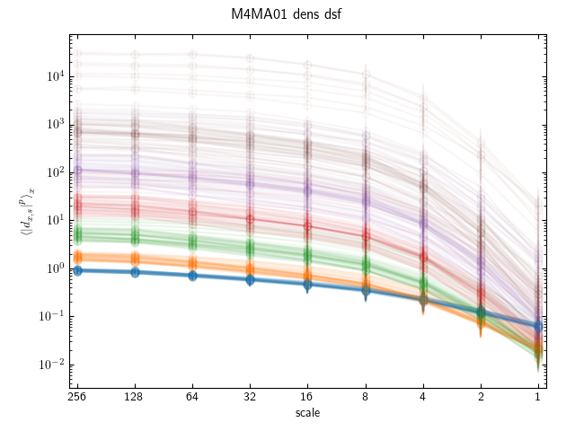||||||||
| 10 ||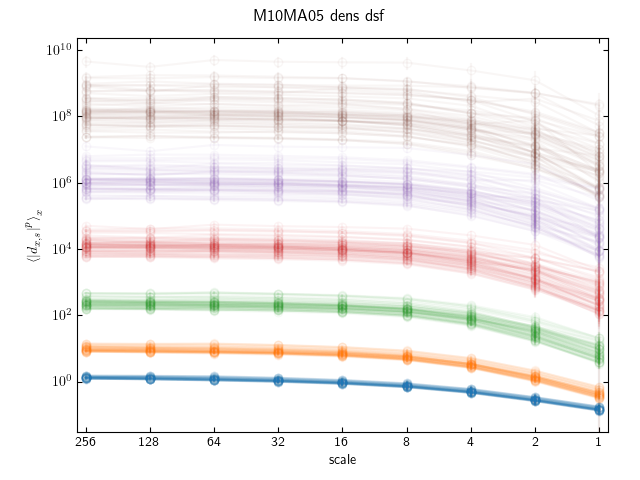|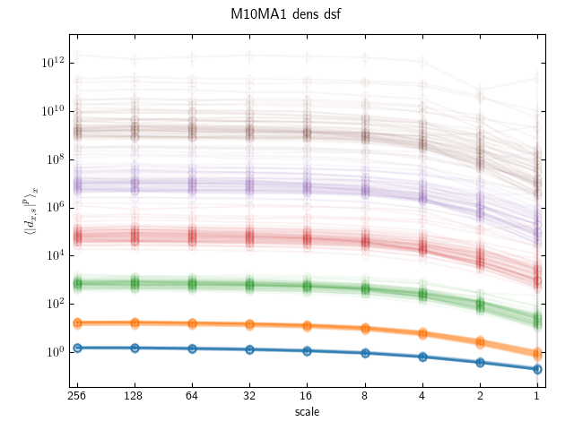|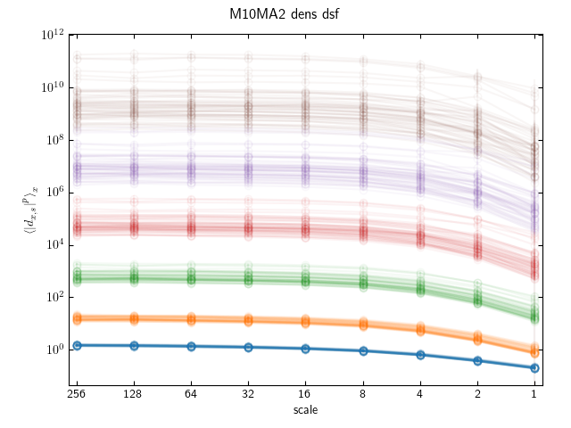|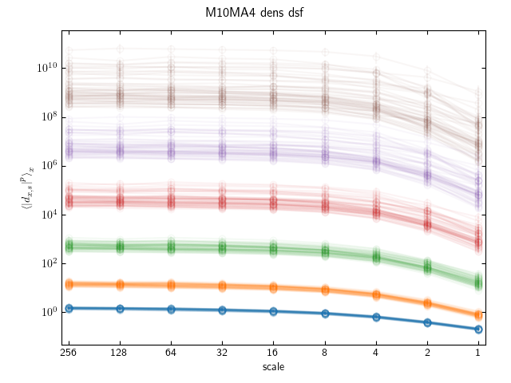||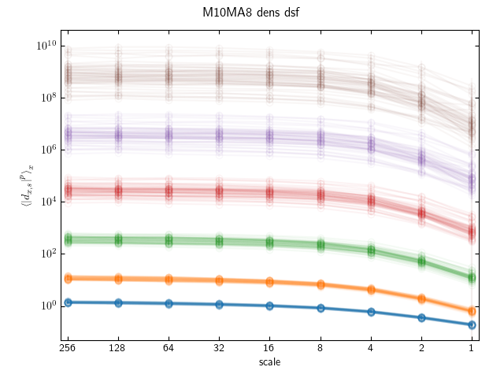||

### Wavelet Structure Function

|M/MA| 01 | 05 | 1 | 2 | 4 | 6 | 8 | 10 |
|----|----|----|---|---|---|---|---|----|
| 05 ||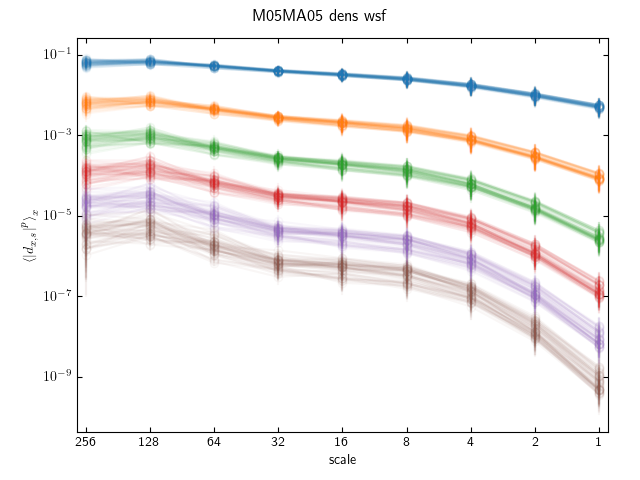||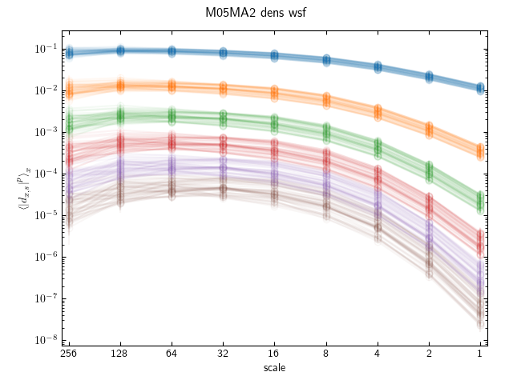|||||
| 2  |||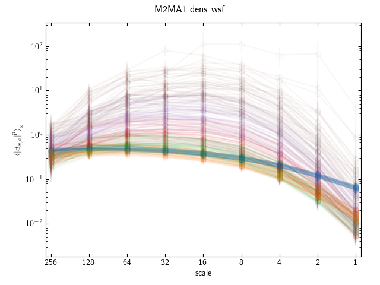||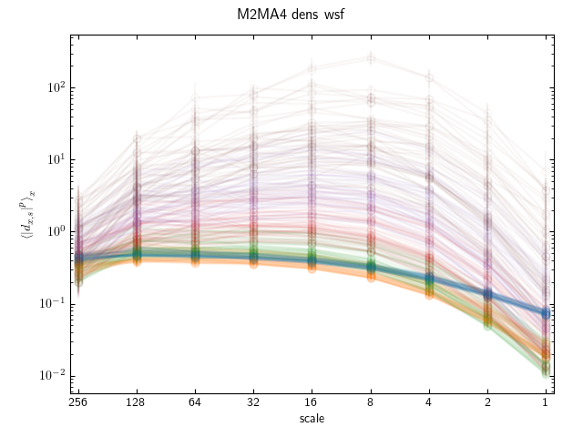|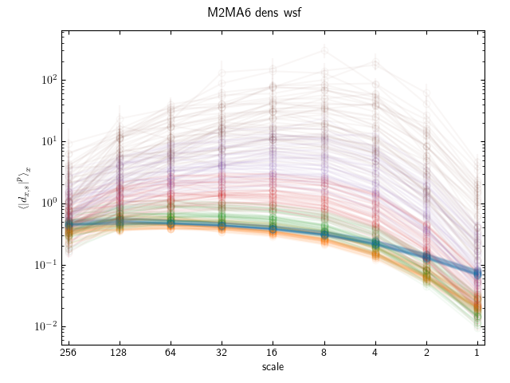|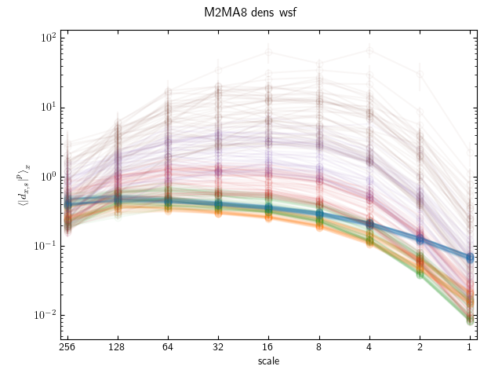||
| 4  |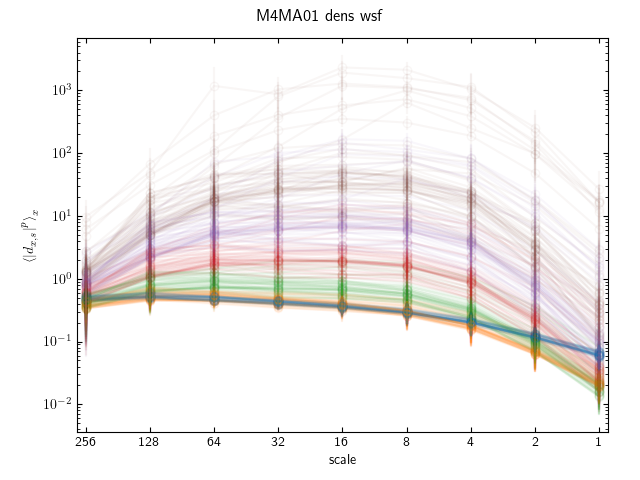|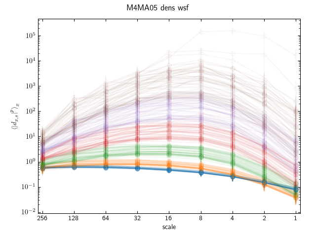|||||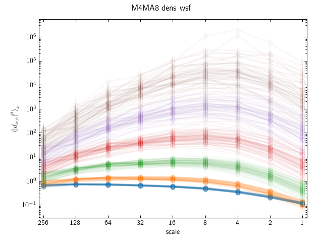||
| 10 ||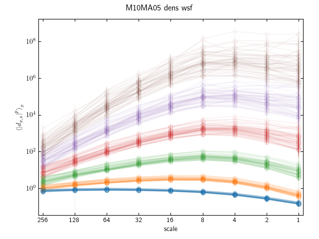||||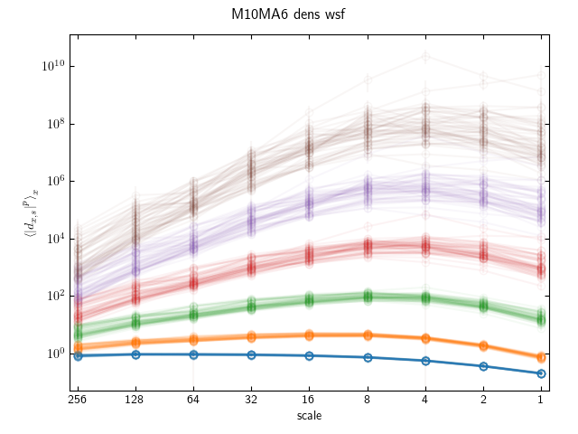|||

## Velocity

vel

## Vorticity

vort

## Magnetic Field

mag

## Current Density

curr
