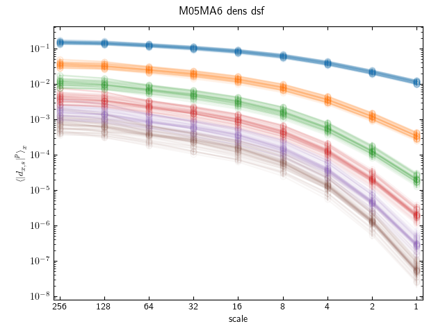

# Structure Functions

Below, we summarize the structure functions for many snapshots for each set of flow parameters and field.
Structure functions are color-coded by their order as follows

  * 1st order : blue
  * 2nd order : orange
  * 3rd order : green
  * 4th order : red
  * 5th order : purple
  * 6th order : brown

## Density

|M/MA| 01 | 05 | 1 | 2 | 4 | 6 | 8 | 10 |
|----|----|----|---|---|---|---|---|----|
| 05 |||||||||

| 2  |
| 4  |
| 10 |

## Velocity

## Vorticity

## Magnetic Field

## Current Density

M05MA01/w4t-plot-structure-function-mom_M05MA01_curr_dsf.png
M05MA01/w4t-plot-structure-function-mom_M05MA01_dens_dsf.png
M05MA01/w4t-plot-structure-function-mom_M05MA01_mag_dsf.png
M05MA01/w4t-plot-structure-function-mom_M05MA01_vel_dsf.png
M05MA01/w4t-plot-structure-function-mom_M05MA01_vort_dsf.png
